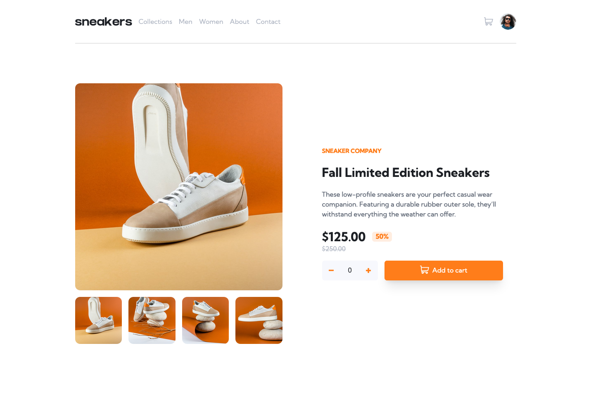
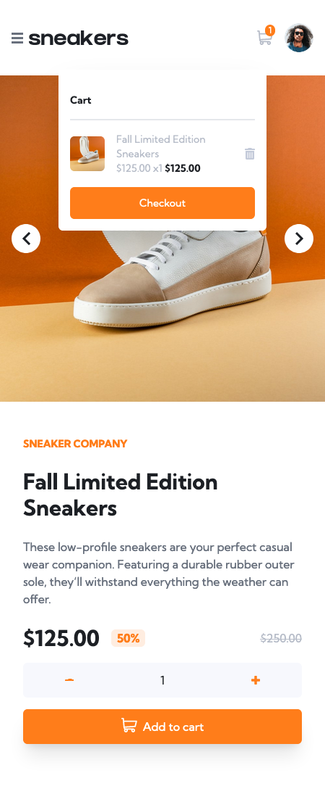

# Frontend Mentor - E-commerce product page solution

This is a solution to the [E-commerce product page challenge on Frontend Mentor](https://www.frontendmentor.io/challenges/ecommerce-product-page-UPsZ9MJp6). Frontend Mentor challenges help you improve your coding skills by building realistic projects.

## Table of contents

-   [Overview](#overview)
    -   [The challenge](#the-challenge)
    -   [Screenshot](#screenshot)
    -   [Links](#links)
-   [My process](#my-process)
    -   [Built with](#built-with)
    -   [What I learned](#what-i-learned)
-   [Author](#author)

## Overview

### The challenge

Users should be able to:

-   View the optimal layout for the site depending on their device's screen size
-   See hover states for all interactive elements on the page
-   Open a lightbox gallery by clicking on the large product image
-   Switch the large product image by clicking on the small thumbnail images
-   Add items to the cart
-   View the cart and remove items from it

### Screenshot

### Links

-   [GitHub repo](https://github.com/darryncodes/ecommerce-product-page)
-   [Live URL](https://darryncodes.github.io/ecommerce-product-page/)

## My process

### Built with

-   [Vite](https://vitejs.dev/) - development server
-   [React](https://reactjs.org/) - JS library
-   [Tailwind CSS](https://tailwindcss.com/) - For styles
-   Mobile-first workflow
-   Semantic HTML5 markup
-   CSS custom properties
-   Flexbox
-   CSS Grid

### What I learned

TBC

## Author

-   Work in progress portfolio site - [darryn.dev](https://darryn.dev/)
-   Frontend Mentor - [@darryncodes](https://www.frontendmentor.io/profile/darryncodes)
-   Twitter - [@darryncodes](https://twitter.com/darryncodes)
